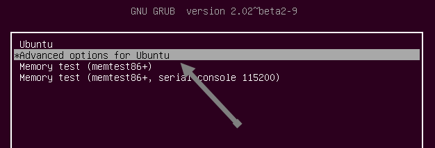
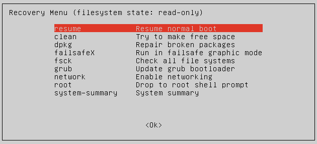

<!-- ## Introdução -->

Nesta época de valorização da privacidade, o uso de senhas é algo cada vez mais importante para a segurança de nossos dados computacionais. Quem já não se deparou com o esquecimento de alguma senha? 

Se isso aconteceu contigo, no uso de sua própria máquina impedindo o acesso a ela, este é um assunto para você.

Sendo esta sua situação, onde você não lembra mais a senha de acesso ao Ubuntu, abaixo segue uma lista tutorial para que a senha seja recuperada e você possa voltar a ter acesso a sua máquina.

 

<!-- detalhamento -->

## 1. Acesso ao *root* da máquina
Inicie a sua máquina e pressione o botão **ESC** até que a tela do GRUB apareça.

Algo similar a isto...

Clique em *Advanced options for Ubuntu*, logo depois você deverá escolher o modo *Recovery Mode* do Ubuntu.

Ao selecionar o modo *RECOVERY*, você será direcionado para o *Recovery Menu*.

Escolha a opção *root - drop to root shell prompt*.

 

## 2. Acessando o *root* da máquina
Você deverá agora montar o sistema de arquivos de **somente leitura** para **permissão de escrita**:

`mount -o rw,remount /`

Agora você estará no ponto para alterar a sua senha.

 

## 3. Alterando a senha
Para alterar a senha, você deverá executar o seguinte comando (lembrando que o **nomedousuário** é justamente o nome do usuário que esqueceu a senha para entrar no Ubuntu):

`sudo passwd nomedousuário`

Defina a nova senha e confirme.

Com a nova senha definida, você deverá agora sair do *root* executando o seguinte comando:

`exit`

 

## 4. Saindo do modo de recuperação
Ao executar o comando `exit`, você retornará para o **Recovery Menu**.

Desta forma, escolha a opção **Resume** e dê um **OK**.

*WELL DONE*

Agora, você já poderá entrar no Ubuntu com a nova senha.

 

<!--
## Simulação
Como o projeto está em desenvolvimento, simulações parciais estão sendo testadas (referência).

 

## Live Action
Testes preliminares também estão sendo realizados em laboratório, onde alguns resultados foram alcançados.

 
-->

<!-- autor -->

<h3 class="post-title">Autor</h3> 

  

    <table class="table-borderless highlight">
      <thead>
        <tr>
          <th></th>
        </tr>
      </thead>
      <tbody>
        <tr class="font-weight-bolder" style="text-align: center margin-top: 0">
          <td>Marco Reis</td>
        </tr>
        <tr style="text-align: center" >
          <td style="vertical-align: top; text-align: justify"><small>Pesquisador Sênior no Centro de Competêhncias em Robótica e Sistemas Autônomos do Senai Cimatec. Apaixonado por robótica e um idealista puro, vive motivando aqueles que caminham em direção ao sucesso. Atualmente segue o interesse do seu coração realizando pesquisa na área de robótica, coordena projetos no Senai Cimatec e lidera o grupo do Centro de Competências em Robótica e Sistemas Autônomos. Marco é formado em engenharia elétrica pela UFPR e mestrado em engenharia de produção pela UFSC. Aguarda anciosamente o novo SuperMetroid e Winds of Winter.</small></td>
          <td></td>
        </tr>
      </tbody>
    </table>
  

 
