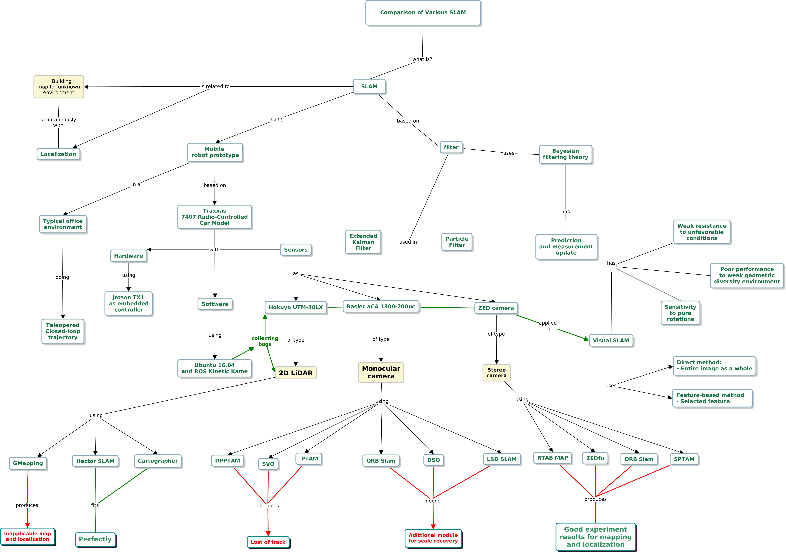
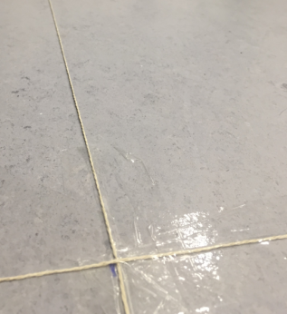
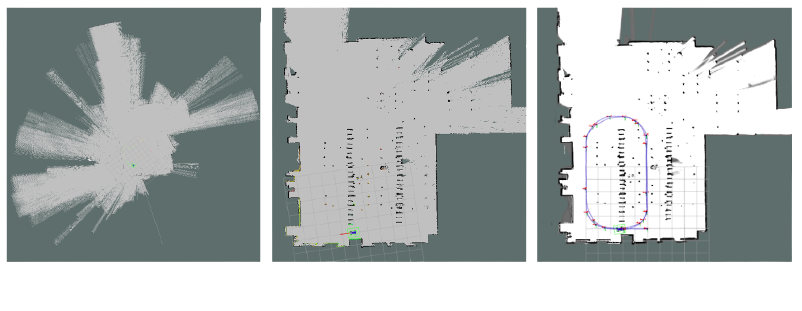

A leitura e apresentação do artigo **Comparison of Various SLAM Systems for Mobile
Robot in an Indoor Environment** contribuiu ativamente para o desenvolvimento
de competências importantes na área de pesquisa focada em robótica. O _conhecimento_
adquirido em um assunto de extrema importância que é o SLAM (Simutaneously navigation
and mapping), permitiu a aplicação de _habilidades_ em atividades recorrentes no laboratório,
por fim, aprensentar o artigo explorou a _atitude_ para transmitir a mensagem aos pares.

## Mapa conceitual

O mapa conceitual é uma ferramenta importante na estruturação do conhecimento que se deseja
adquirir, transmitir ou aprofundar, foi feito um mapa conceitual que mostra de forma resumida
o que será apresentado no artigo:

{:.center}

## O que é SLAM?

Em robótica móvel, o processo de construção de um mapa de forma simultânea com a localização
do robô é substancialmente importante em navegação e exploração. De forma sucinta, o termo
SLAM do inglês _simutaneously localization and mapping_ se refere a construção de um mapa
desconhecido ao mesmo tempo em que o robô se localiza no ambiente. O artigo estudado propõe
a comparação de alguns métodos de SLAM utilizando um protótipo de robô móvel em ambiente 
fechado.

#### Protótipo Innopolis UGV

{:.center}

O protótipo Innopolis possui um sensor do tipo **LiDAR** (Light Detection And Ranging) 2D, **câmera
monocular** e **câmera stereo**, o pesquisador propõe testar alguns métodos específicos para construção
de mapas (SLAM) utilizando os sensores presentes no protótipo.

#### O ambiente do experimento

Os testes foram realizados em um ambiente típico de escritório no qual foi delimitado uma área específica
em que o robô foi operado e feita a coleta de dados dos sensores, esse foi o ambiente utilizado:

{:.center}

O ambiente do escritório foi delimitado por uma linha, sendo assim possível fazer comparações na mesma situação de
navegação:

{:.center}

A seguir serão apresentados os métodos que foram experimentados.

## Métodos utilizando sensor LiDAR

#### GMapping, Hector SLAM e Cartographer
O _Gmapping_ não construiu um mapa preciso do ambiente em questão, já o _Hector SLAM_ e o _Cartographer_ obtiveram
mapas precisos e quase similares, o autor considera que o _Cartographer_ representa a melhor escolha para construção do
mapa com sensor LiDAR, a seguir, é possível ver o mapas gerados pelo Gmapping, Hector SLAM e Cartographer respectivamente:

{:.center}

## Métodos utilizando Câmera monocular

#### LSD, ORB e DSO
O LSD SLAM (Large scale Direct monocular SLAM) é um método que utiliza imagem local para estimar a posição do robô, ORB SLAM é um método basedo na criação de recursos do ambiente e cria nuvem de pontos, estimando também a posição do robô, DSO (Direct Sparse Odometry)
é um método direto, os métodos citados obtiveram sucesso na construção do SLAM, a seguir, é possível ver o mapas gerados pelo LSD SLAM, ORB SLAM e DSO:

{:.center}

## Métodos utilizando Câmera Stereo 

#### RTAB map, ORB (stereo) e S-PTAM

RTABM map (Real-Time Appearence-Based Mapping) é um método baseado na criação de recursos do ambiente e cria nuvem de pontos, 
o ORB é similar porém utiliza camera stereo nesse caso, o S-PTAM (Stereo Parallel Tracking and Mapping) é um sistema capaz
de capturar a trajetória da câmera em tempo real, os métodos citados obtiveram sucesso na construção do SLAM, a seguir, é possível ver o mapas gerados pelo RTAB map, ORB e S-PTAM:

{:.center}

### Conclusão

A leitura do artigo permite concluir que os métodos que utilizam câmera stereo são bastante relevantes na localização
e na construção do mapa do sistema robótico em questão, além disso, é possível ter informações gerais a respeito
de alguns métodos que podem ser explorados em diversas situações reais contribuindo para o desenvolvimento
de projetos futuros.